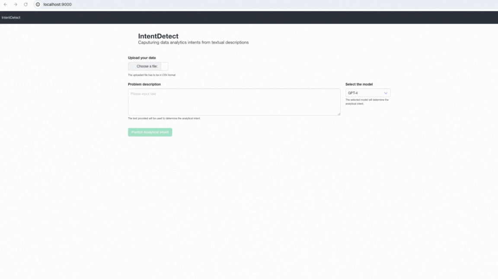

# IntentDetect

Capturing Analytical Intents from Text

## Getting started

### Before you begin

- You should have [Docker](https://www.docker.com/) installed on your machine.
- You should have ```.env``` file in the root folder with your API keys stored.

  ```
  OPENAI_API_KEY=<YOUR OPENAI_API_KEY>
  LlamaAPI_KEY=<LlamaAPI_KEY>
  ```
For more information on how to obtain API Keys, refer to : [OpenAI](https://platform.openai.com/docs/quickstart) and [LLama AI](https://docs.llama-api.com/api-token).
  

### Building Docker image

In order to build a Docker image yourself run the following command.

```bash
# run build Docker command
docker build . -t <image-name>:<image-tag>
```

Based on your platform installation you may need to use `sudo` or other platform
specific adjustments.

Make sure that you do not have put any private data in the current folder as it
will be added to the Docker image you created and as such available to anyone
who come in position of the image. 

### Start Docker container

For starting Docker container we can use the `docker` commands.

```bash
# run container
docker run --rm -p 9000:9000 --name='<container-name>' <image-name>:<image-tag>
```

## Usage Example

```bash
# build docker image
docker build -t intent-detect:latest .
```

```bash
# run container
docker run --rm -p 9000:9000 --name='intent-detect-c1' intent-detect:latest
```

If needed you can connect to running Docker container.

```bash
# connect to started container
docker exec -it intent-detect-c1 /bin/sh
```

### Navigate to application

In order to engage with application you should navigate your web browser to
`http://localhost:9000` or you can use `curl`.

```bash
curl -X GET http://localhost:9000
```

  

## References

* [Use the Docker command line](https://docs.docker.com/engine/reference/commandline/cli/)
* [Flask](https://flask.palletsprojects.com/en/3.0.x/) - WSGI web application framework.
* [Bulma](https://bulma.io/) - CSS Framework.
* [AlpineJs](https://alpinejs.dev/) - JavaScript framework.
* [OpenAI](https://platform.openai.com/overview) - API for OpenAI Models
* [LLama AI](https://www.llama-api.com/) - API for Llama and Open-Source Models
